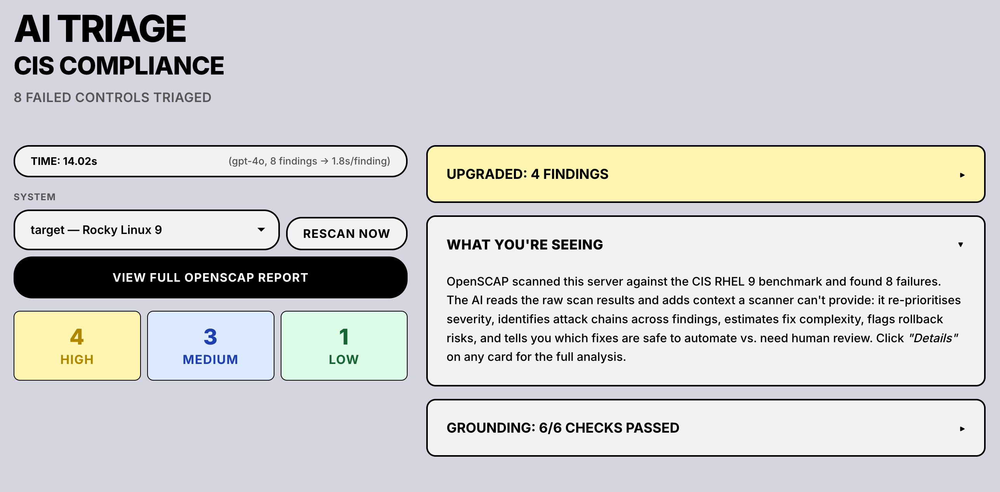
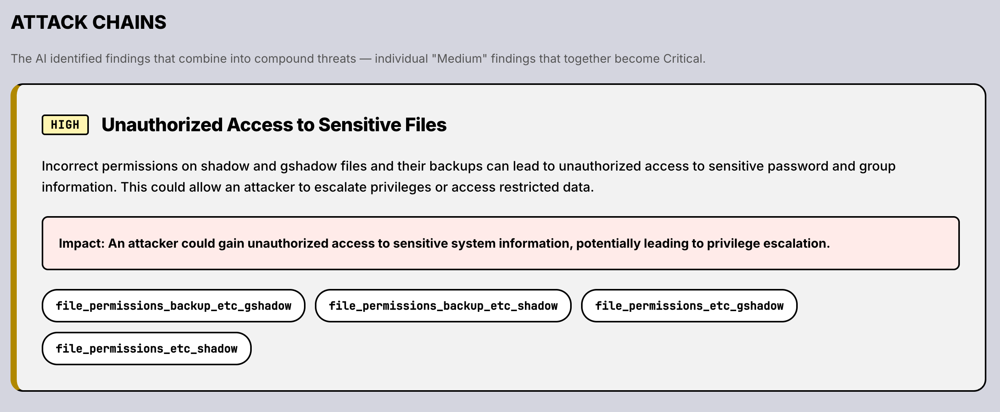
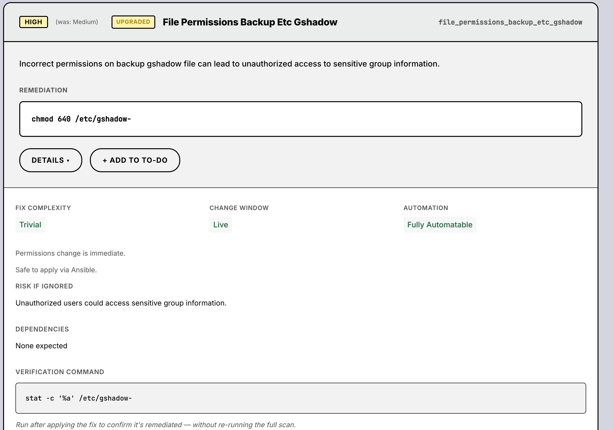
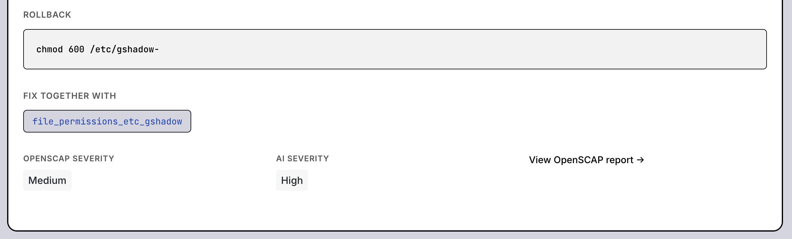

# GovTech Beacon Assessment — IT Controls, Cybersecurity & AI Integration

Assessment submission for the GovTech Beacon programme, covering system hardening, CIS Benchmarks, automation, and AI-augmented security tooling.

## Demo — CIS Compliance Triage

A working pipeline that scans a RHEL server against CIS security benchmarks, uses AI to triage findings, and presents them as actionable cards.

**One command**: `cd demo && podman compose up --build` → http://localhost:5001

### How it works

1. **Scan** — Ansible SSHs into a Rocky Linux 9 target (13 intentional CIS violations), runs OpenSCAP CIS Level 1 scan, fetches XML + HTML results
2. **AI Triage** — Parses scan XML, sends failed controls to gpt-4o. Returns: re-prioritised severity, remediation, verification commands, rollback instructions, attack chains
3. **Grounding** — 6 programmatic checks validate every AI output against the scan data (no LLM-as-judge needed)
4. **Web UI** — MR-style cards with expandable detail panels

### Attack Chains

The AI groups findings that combine into compound threats — surfacing risks no single-finding report would catch.

### Finding Cards

Each finding shows AI-assessed severity (⬆ Upgraded if higher than OpenSCAP's rating), explanation, and remediation.
Expand for: fix complexity, change window, automation readiness, verification command, rollback, related findings.

### Key design decisions

- **Deterministic scanner, AI interpreter** — OpenSCAP determines compliance (auditable, reproducible). AI explains, prioritises, and drafts remediations but never determines pass/fail.
- **AI grounded by architecture** — AI can't access servers. Input is bounded (XML only). Output is validated (6 programmatic checks). Actions are gated (human approval).
- **No auto-remediation** — Findings presented as change requests for engineers to review and approve.

See [`demo/README.md`](demo/README.md) for quickstart, architecture, and file details.
